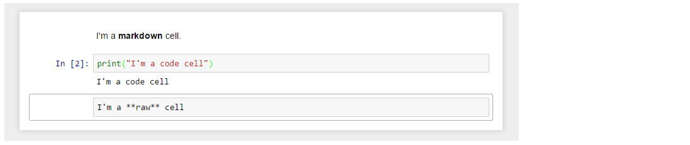
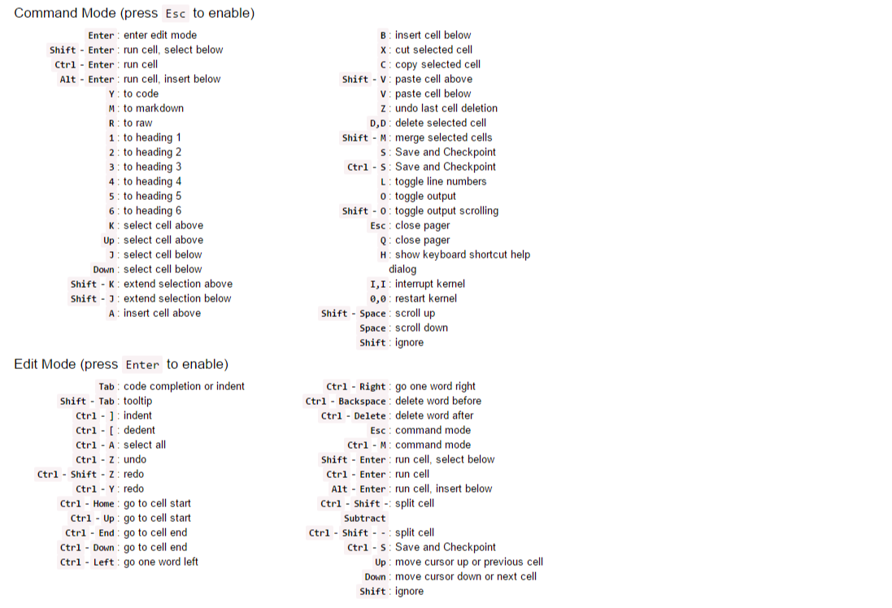

# Short-term ATLAS Internship

## Requirements
- Python
- Anaconda
- Jupyter Notebooks
- Git
- Terminal/preferred Integrated Development Environment (IDE)

## Set-up Instructions

### Python

First, let's ensure that we have the required Python version installed and test this out "in-line"
In your terminal write:
```
$ python --version
Python 3.13.13
```
If you return an error or your computer doesn't recognise this command it is likely due to Python not yet being installed. To install python manually go to [python.org](https://www.python.org/downloads/) and click "Download the latest version for [Your Operating System]". After this has finished downloading, open a new terminal and try the above command again.
To double check things are working, in the same terminal, try to print a simple string:
```
$ python      
Python 3.13.13 | packaged by Anaconda, Inc. | (main, Apr 14 2026, 06:14:06) [Clang 20.1.8 ] on darwin
Type "help", "copyright", "credits" or "license" for more information.
>>> msg = "Hello world"
>>> print(msg)
Hello world
```

### Anaconda

Next, we'll need to set-up [Anaconda](https://docs.conda.io/projects/conda/en/latest/user-guide/getting-started.html), which is package manager that helps organise environments and software libraries in Python. Navigate to the [installation page](https://www.anaconda.com/docs/getting-started/installation) and click through the different options for operating system, version and type of installation. 
After following the instructions for installation we can verify that it has successfully finished with,
```
$ conda list
# packages in environment at /Users/XYZ/Anaconda3:
#
# Name                      Version          Build               Channel
anaconda-anon-usage         0.7.6            pyhb46e38b_100
anaconda-auth               0.14.2           py313hca03da5_0
anaconda-cli-base           0.8.2            py313hca03da5_0
annotated-types             0.6.0            py313hca03da5_1
...[50 lines omitted]
```
which prints a list of the currently installed packages.

Among the most useful features of Conda is the creation of [environments](https://docs.conda.io/projects/conda/en/latest/user-guide/getting-started.html). These act as separate instances of Python that can have different libraries installed. Once they are set-up you can return to them at any time and use the same packages as before. A helpful [cheat sheet](https://docs.conda.io/projects/conda/en/latest/user-guide/tasks/manage-environments.html) contains many frequently useful commands. 
To make an environment is very easy, just use:
```
$ conda create --name <your-fave-env-name>
```
when conda asks you to proceed, type `y`:
```
proceed ([y]/n)?
```

This will create an environment called `<your-fave-env-name>` which you can see has been created and added to the list of existing current environments. Try it out with:
```
$ conda info --envs
conda environments:

   base          *  /home/username/Anaconda3
   <your-fave-env-name>   /home/username/Anaconda3/envs/<your-fave-env-name>
```
To activate the environment you can run:
```
conda activate <your-fave-env-name>
```
And you'll know this has worked because your terminal will have changed from something like:
```
(base) username@laptop some_directory $ 
```
to 
```
(<your-fave-env-name>) username@laptop some_directory $ 
```
Now, we're in the correct conda environment we can set-up the Python libraries that we will use throughout the project. There are a number of ways to install these Python packages, first when inside the conda environment we use:
```
$ conda install numpy scipy matplotlib notebook pandas seaborn requests
```
Some packages require a different channel in order to install correctly. To get these libraries we need
```
conda install conda-forge::vector conda-forge::uproot conda-forge::lmfit conda-forge::atlasopenmagic
```


### Jupyter 

Now we should have all of the Python libraries necessary to run the code inside the Jupyter Notebooks that we'll use throughout the project. If you are working from inside your terminal then we need to launch a Jupyter session, we can do this by fist navigating to the desired directory
```
$ cd <directory_we_want>
$ jupyter notebook --no-browser
```
Which outputs a large set of logs and diagnostics containing the following instructions
```
...
[C 2026-09-28 17:26:20.627 ServerApp] 
    
    To access the server, open this file in a browser:
        file:/Users/username/Library/Jupyter/runtime/jpserver-12728-open.html
    Or copy and paste one of these URLs:
        http://localhost:8888/tree?token=674c8d3d4f83ce598e8f72e76c152830e089847dcd6f0142
        http://127.0.0.1:8888/tree?token=674c8d3d4f83ce598e8f72e76c152830e089847dcd6f0142
```
Copying the URL or opening the .html file will connect the Jupyter session to the directory we ran the command in. Now we'll be able to run code within any Jupyter notebooks (.ipynb files).


When a notebook is opened, a new browser tab will be created which presents the notebook user interface (UI). This UI allows for interactively editing and running the notebook document.
A new notebook can be created from the dashboard by clicking on the Files tab, followed by the New dropdown button, and then selecting the language of choice for the notebook.
An interactive tour of the notebook UI can be started by selecting Help &rarr; User Interface Tour from the notebook menu bar.

#### Header
At the top of the notebook document is a header which contains the notebook title, a menubar, and toolbar. This header remains fixed at the top of the screen, even as the body of the notebook is scrolled. The title can be edited in-place (which renames the notebook file), and the menubar and toolbar contain a variety of actions which control notebook navigation and document structure.


#### Body
The body of a notebook is composed of cells. Each cell contains either markdown, code input, code output, or raw text. Cells can be included in any order and edited at-will, allowing for a large ammount of flexibility for constructing a narrative.

- **Markdown cells** - These are used to build a nicely formatted narrative around the code in the document. The majority of this lesson is composed of markdown cells.
- **Code cells** - These are used to define the computational code in the document. They come in two forms: the input cell where the user types the code to be executed, and the output cell which is the representation of the executed code. Depending on the code, this representation may be a simple scalar value, or something more complex like a plot or an interactive widget.
- **Raw cells** - These are used when text needs to be included in raw form, without execution or transformation.



#### Mouse navigation

The first concept to understand in mouse-based navigation is that **cells can be selected by clicking on them.** The currently selected cell is indicated with a grey or green border depending on whether the notebook is in edit or command mode. Clicking inside a cell's editor area will enter edit mode. Clicking on the prompt or the output area of a cell will enter command mode.

The second concept to understand in mouse-based navigation is that **cell actions usually apply to the currently selected cell**. For example, to run the code in a cell, select it and then click the <button class='btn btn-default btn-xs'><i class="fa fa-play icon-play"></i></button> button in the toolbar or the **`Cell -> Run`** menu item. Similarly, to copy a cell, select it and then click the <button class='btn btn-default btn-xs'><i class="fa fa-copy icon-copy"></i></button> button in the toolbar or the **`Edit -> Copy`** menu item. With this simple pattern, it should be possible to perform nearly every action with the mouse.

Markdown cells have one other state which can be modified with the mouse. These cells can either be rendered or unrendered. When they are rendered, a nice formatted representation of the cell's contents will be presented. When they are unrendered, the raw text source of the cell will be presented. To render the selected cell with the mouse, click the <button class='btn btn-default btn-xs'><i class="fa fa-play icon-play"></i></button> button in the toolbar or the **`Cell -> Run`** menu item. To unrender the selected cell, double click on the cell.


#### Keyboard navigation

The most important keyboard shortcuts are **`Enter`**, which enters edit mode, and **`Esc`**, which enters command mode.

In edit mode, most of the keyboard is dedicated to typing into the cell's editor. Thus, in edit mode there are relatively few shortcuts. In command mode, the entire keyboard is available for shortcuts, so there are many more possibilities.

The following images give an overview of the available keyboard shortcuts. These can viewed in the notebook at any time via the **`Help -> Keyboard Shortcuts`** menu item.



The following shortcuts have been found to be the most useful in day-to-day tasks:

- Basic navigation: **`enter`**, **`shift-enter`**, **`up/k`**, **`down/j`**
- Saving the notebook: **`s`**
- Cell types: **`y`**, **`m`**, **`1-6`**, **`r`**
- Cell creation: **`a`**, **`b`**
- Cell editing: **`x`**, **`c`**, **`v`**, **`d`**, **`z`**, **`ctrl+shift+-`**
- Kernel operations: **`i`**, **`.`**


